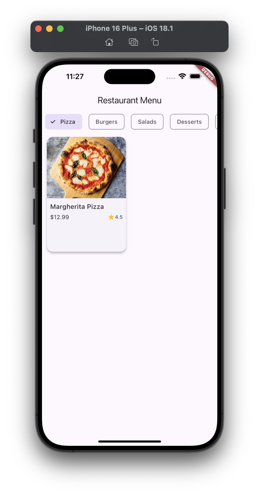
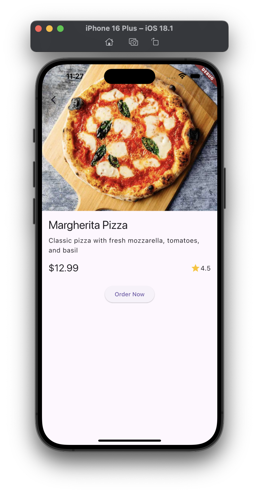

# 🍽️ Restaurant Menu App

## 📱 Project Overview
A Flutter-based restaurant menu application with a sleek, responsive design that supports both portrait and landscape orientations. Explore a variety of food categories and discover delicious menu items!

## ✨ Features
- 📋 Horizontal category list
- 🍲 Food item grid display
- 🔍 Detailed food item page
- 📱 Responsive layout (portrait and landscape modes)
- ⭐ Interactive food item cards with ratings

## 🛠️ Setup Instructions
1. Ensure you have Flutter installed (https://flutter.dev/docs/get-started/install)
2. Clone the repository ()
3. Navigate to the project directory (cd restaurant_menu_app)
4. Install dependencies (flutter pub get)
5. Add images to the `assets/images/` directory
6. Update `pubspec.yaml` to include asset images
7. Run the app (flutter run)

## 📂 Project Structure

lib/
├── models/
│   └── food_item.dart
├── screens/
│   ├── home_screen.dart
│   └── food_detail_screen.dart
├── widgets/
│   ├── category_list.dart
│   └── food_item_card.dart
└── data/
└── food_data.dart

## 📸 Screenshots

### Home Screen

### Food Detail Screen

## ✅ Requirements Checklist
- [x] Home Screen with category list
- [x] Food Grid Display
- [x] Detailed Food Item Page
- [x] Responsive Layout
- [x] Food Item Card with image, name, price, rating

## 🚀 Future Improvements
- [ ] Implement shopping cart functionality
- [ ] Add search capability
- [ ] Enhance UI with more animations
- [ ] Implement state management